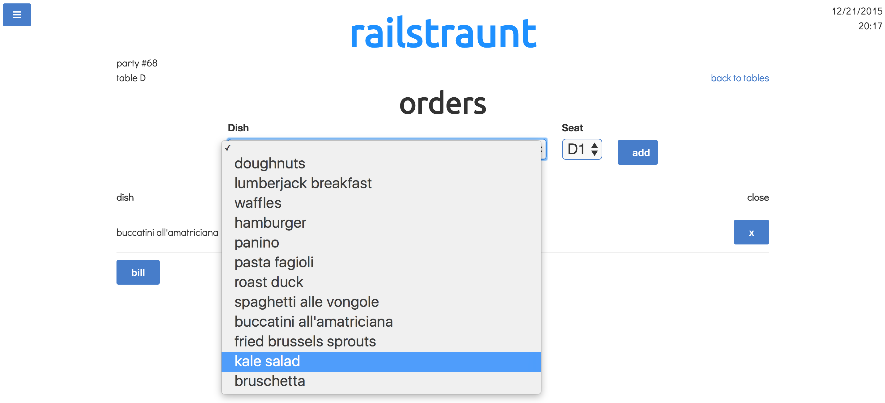
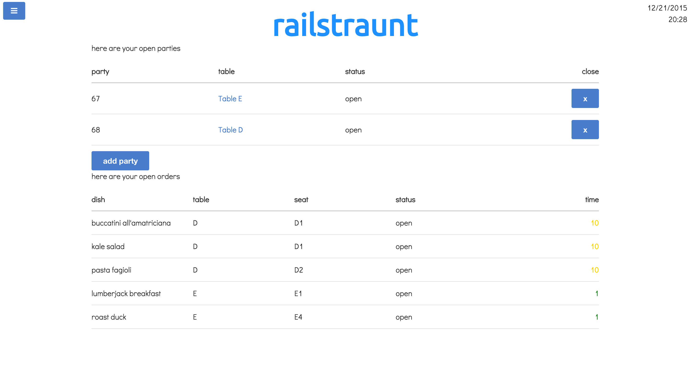
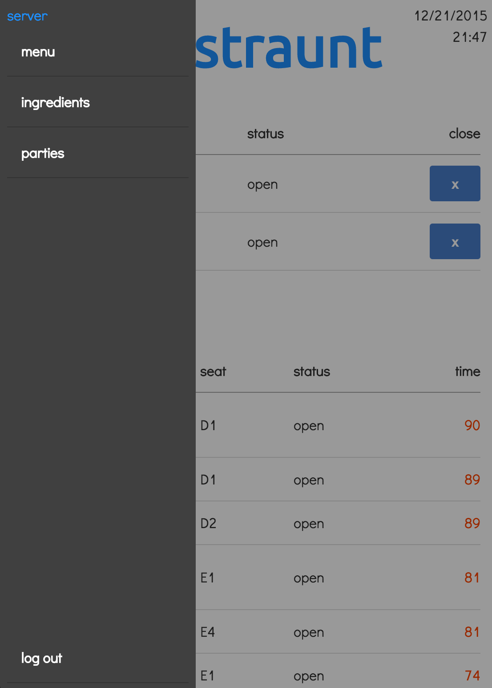
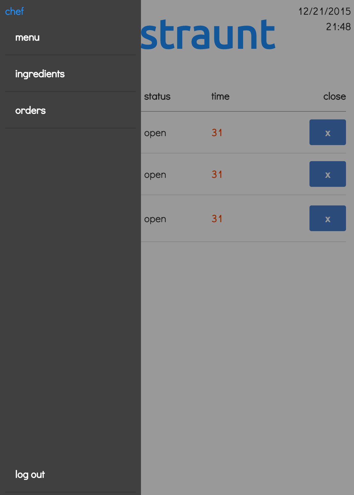

Railstraunt is a restaurant order and menu management system built on Ruby on Rails.  There are three intended users for this application: servers, chefs, and managers (or admins) of restaurants.  There are three different types of accounts for each of these users, each with different abilities.

The main purpose for a server is to have the ability to assign a party of guests to a table, and to assign food orders to a particular seat at that table.  First, the user adds a party by selecting which table they are sitting at.  Then it will appear on the main server view page which shows all of the user's open tables.

When the user clicks on the table, it goes to the party view page, where they can assign menu items to a particular seat via two dropdown menus.

As the user assigns orders to seats, they will appear on the party view page for that party.  If the user goes back to view all of the tables they have assigned to them, they will be able to see all of the outstanding orders that need to be delivered.

As the server delivers the food items, they can mark them as closed and they will no longer appear in this view.  When a table is ready to get their bill, the user can pull up the bill page, and all of the orders that haven't been paid for yet will appear, along with a tip dropdown to automatically add the tip.

The navigation on the application is mainly done through the slide out menu on the left.  Since there are three different types of users, the navigation bars show different things depending on who is logged in.

server view:

chef view:

admin view:

As the servers assign orders, the chefs have the ability to see all of the outstanding orders.  They can also see the number of minutes it has been since the order was put in.  This number changes color based on how long it has been.  It will show green for under 10 minutes, yellow for 10-20, orange for 20-30 and red for 30 or more.

